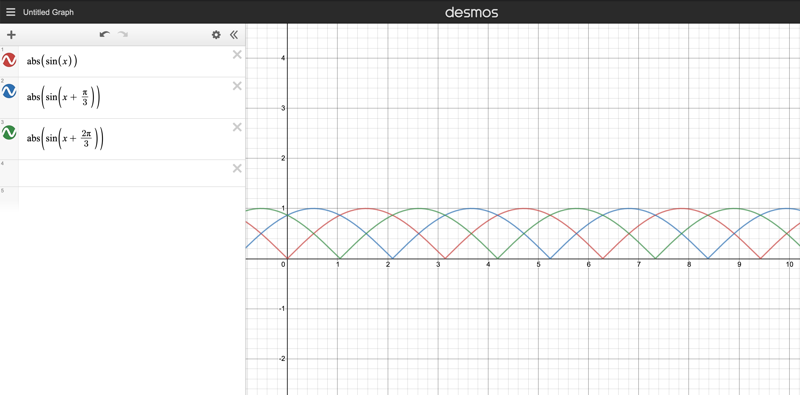

# Getting Started: Notes

* There are lot of complicated ways to transmit data and instructions. Need to rewatch that section and do a Wikipedia deep dive.
* U-shaped jumper cables! Like regular jumper cables, but flat!
* The analogue version of `digitalWrite` is... `analogWrite`!
* Not a fan of the sudden change from 100% brightness to 0%. Rather than having the delay be inversely proportional to the brightness, I want it inversely proportional to the magnitude away from the "middle" - whether light or dark.
Meh, this whole variable transition speed thing is overrated. Nuked.
* Visualizing the equations helped it click in my head. It's just three sine curves (well, piped through `abs()`), each offset by a third of half a cycle (because it takes half a cycle for the y-value to go back to what it was at 0).

## Questions

1. How does the LDR actually work? Why do we hook the "positive side" of the LDR to the analogue input?
My guess is that we get a current reading from that part and it changes depending on how much resistance the LDR has, which in turn depends on the ambient light.
But why wouldn't we hook it up at the other end of the LDR when the current has gone through?
2. What's the best way to debug Arduino code at runtime without using the IDE? What's the Arduino equivalent of console.log?
3. Why does `power` have to be between 2 and 255?
It's to do with [analogWrite](https://www.arduino.cc/reference/en/language/functions/analog-io/analogwrite/) - you need to give it a value between 0 (off) and 255 (on). Not a concidence that this feels binaryish.
